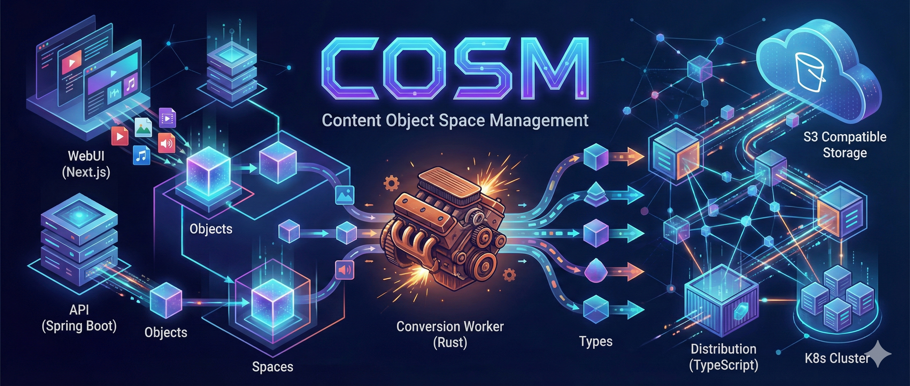
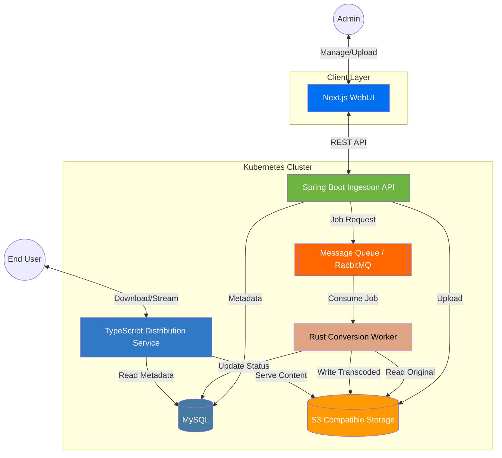

# content-object-space-management

COSMは「空間・物体・型」の3階層モデルでメディア資産を最適化する管理システムです。Next.jsとSpring Bootによる柔軟な入稿基盤に加え、パフォーマンスを追求したRust製変換ワーカーを搭載。非同期実行により、負荷の高い処理を分離し、任意のタイミングでの高速変換を実現します。配信層にはTypeScriptを採用し、S3互換ストレージとKubernetesを組み合わせることで、大規模運用に耐えうる極めて高いスケーラビリティを提供します。

## システム全体構成（マイクロサービスアーキテクチャ）

各機能を独立したサービスとして構築し、**メッセージキュー（RabbitMQ や Kafka 等）**を介して非同期に連携させることで、変換処理の遅延実行とスケーラビリティを確保します。

- Web UI (Next.js): 管理画面。API 経由でメディアの状態確認、アップロード指示、変換リクエストを行う。
- Ingestion API (Spring Boot): 入稿の司令塔。MySQL へのメタデータ書き込み、S3 へのアップロード処理、変換ジョブのキューイングを担当。
- Conversion Worker (Rust): CPU 集約型の変換処理を担当。キューからジョブを受け取り、FFmpeg 等を利用して変換。
- Distribution Service (TypeScript): 配信専用の軽量プロキシ/ゲートウェイ。
- Data Store: MySQL (メタデータ) + S3 互換ストレージ (実ファイル)。

## 「空間・物体・型」のデータモデル設計

|階層|単位|主な役割|
|---|---|---|
|空間 (Space)|チーム / プロジェクト|権限管理、クォータ制限、配信設定の分離。|
|物体 (Object)|アセット ID,「ある一つの動画」や「ある一つの写真」という概念。論理的な一塊。|
|型 (Type)|ファイル実体|original, hls_720p, thumbnail_png など、用途別の変換済みファイル。|

## 変換処理 (Rust) の切り離し

「遅延実行」と「任意のタイミングでの実行」を実現するため、Event-Driven Architecture を採用します。

- 入稿時: Spring Boot が「物体」を作成し、 `status=pending` で DB 保存。同時に「変換要求」をキューへ送信。
- Rust Worker: キューを監視。アイドル状態の Pod がジョブを拾い、S3 から素材を DL して変換、再度 S3 へ UP。完了後に DB の「型」情報を更新。
- 任意実行: Web UI から特定の `object_id` に対して再度キューを飛ばすことで、いつでも再変換が可能。
