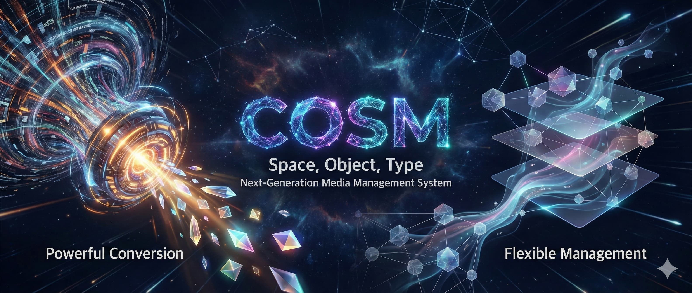
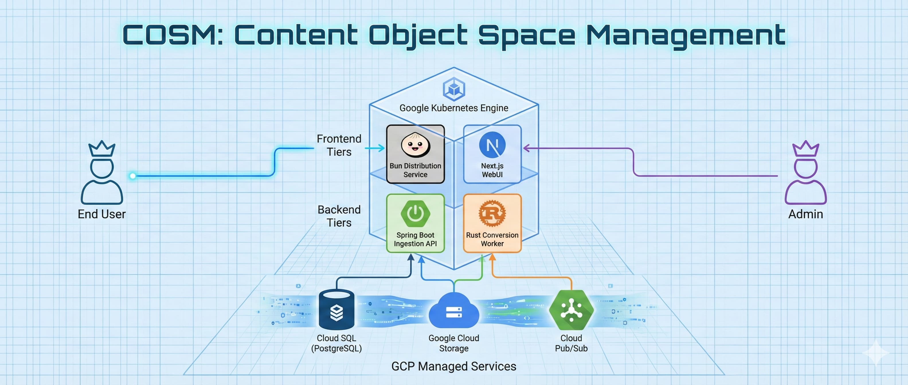
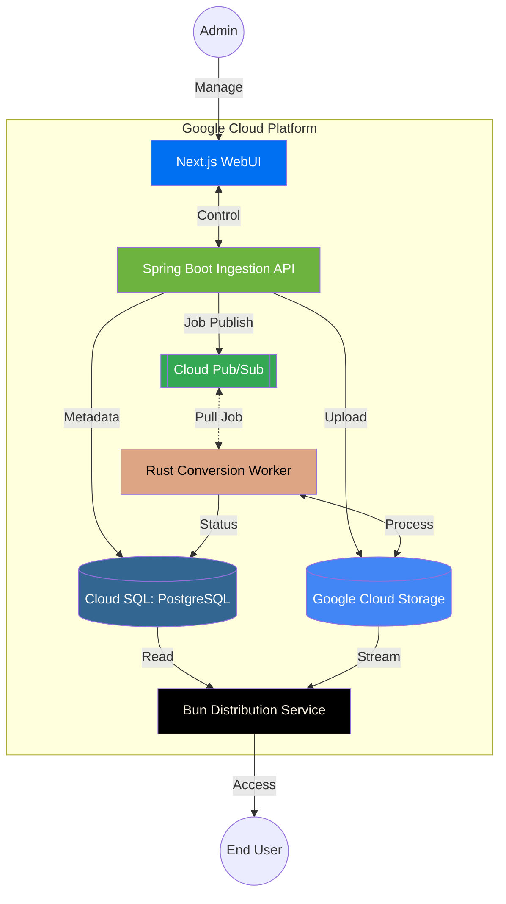

# content-object-space-management

COSMは「空間・物体・型」の3階層モデルでメディア資産を最適化する管理システムです。Next.jsとSpring Bootによる柔軟な入稿基盤に加え、パフォーマンスを追求したRust製変換ワーカーを搭載。非同期実行により、負荷の高い処理を分離し、任意のタイミングでの高速変換を実現します。配信層にはTypeScriptを採用し、S3互換ストレージとKubernetesを組み合わせることで、大規模運用に耐えうる極めて高いスケーラビリティを提供します。

## システム構成の基本方針

1. **疎結合なマイクロサービス** : 各コンポーネントを独立させ、スケーリングや障害の影響範囲を最小化する。
2. **イベント駆動型（Pullモデル）の非同期処理** : メディア変換という重い処理をPub/Subを介したPull型にすることで、ワーカー側の負荷制御（バックプレッシャー）と長時間処理の安定性を確保。
3. **データ一貫性の分離** : メタデータ（PostgreSQL）と実ファイル（GCS）の整合性は、Ingestion APIが司令塔となって担保する。
4. **ポータビリティと開発効率** : 全コンポーネントをDocker化し、本番（GKE/GCP）と開発環境（Local/Emulator）で同一のロジックが動くようにする。
5. **3階層（Space/Object/Type）による論理管理** : ストレージの物理パスとDBの論理構造を一致させ、運用の透明性を高める。

## コンポーネント

|コンポーネント|技術スタック|主な責務|
|---|---|---|
|Web UI|Next.js|ユーザー/管理者向け画面。ファイルのアップロード指示、管理、変換リクエスト。|
|Ingestion API|Spring Boot|システムの司令塔。メタデータ管理、GCSへの初回アップロード、変換ジョブのPub/Sub発行。|
|Conversion Worker|Rust|高性能変換エンジン。Pub/SubからジョブをPullし、FFmpeg等を用いてメディアを変換。|
|Distribution Service|Bun(TypeScript)|コンテンツ配信プロキシ。認証チェック、GCSへのセキュアなアクセス、スケーラブルな配信。|
|Metadata Store|PostgreSQL|空間・物体・型のリレーション、各ファイルのメタデータ（JSONB形式）の永続化。|
|Blob Storage|GCS|メディアファイル実体の保存先。S3互換モードまたはJSON APIを利用。|
|Message Broker|Cloud Pub/Sub|IngestionからWorkerへジョブを伝達するためのメッセージ基盤。|

## 「空間・物体・型」のデータモデル設計

|階層|単位|主な役割|
|---|---|---|
|空間 (Space)|チーム / プロジェクト|権限管理、クォータ制限、配信設定の分離。|
|物体 (Object)|アセット ID|「ある一つの動画」や「ある一つの写真」という概念。論理的な一塊。|
|型 (Type)|ファイル実体|original, hls_720p, thumbnail_png など、用途別の変換済みファイル。|

## 変換処理 (Rust) の切り離し

「遅延実行」と「任意のタイミングでの実行」を実現するため、Event-Driven Architecture を採用します。

- 入稿時: Spring Boot が「物体」を作成し、 `status=pending` で DB 保存。同時に「変換要求」をキューへ送信。
- Rust Worker: キューを監視。アイドル状態の Pod がジョブを拾い、S3 から素材を DL して変換、再度 S3 へ UP。完了後に DB の「型」情報を更新。
- 任意実行: Web UI から特定の `object_id` に対して再度キューを飛ばすことで、いつでも再変換が可能。
